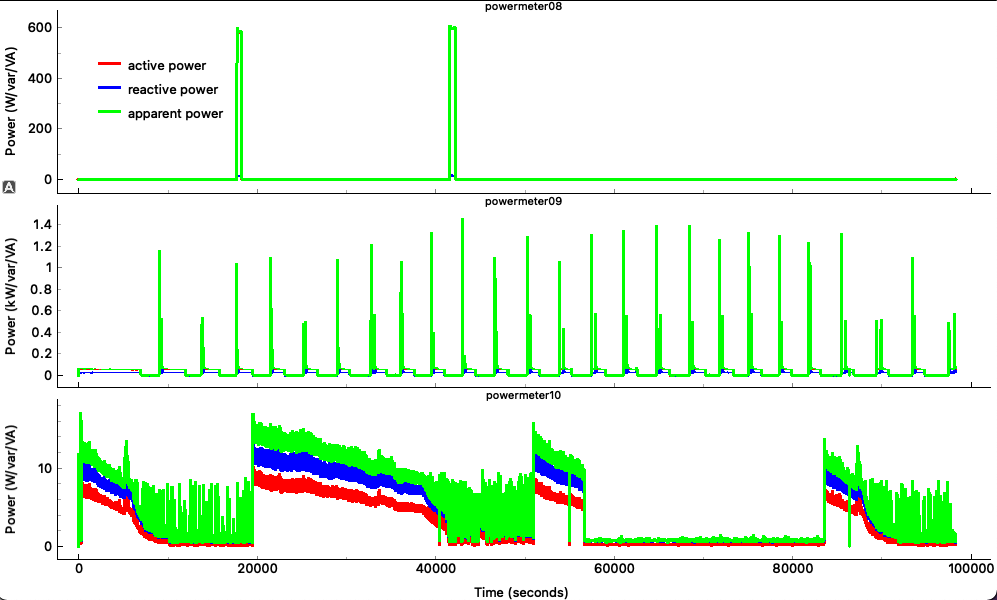
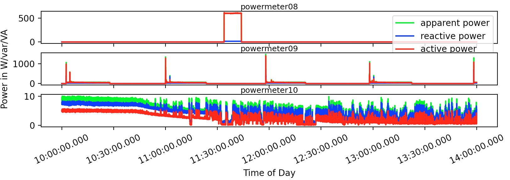
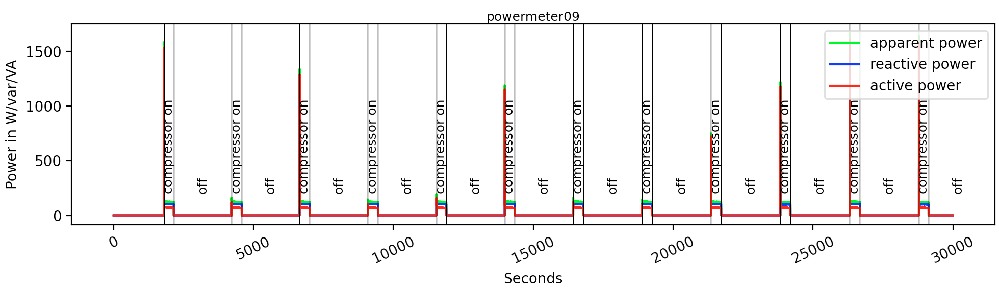

# Matroska Plotter
A python module to plot data encoded as audio streams inside a matroska containers.

## Installation

Install latest ```ffmpeg``` on your system 

Required python packages installation:
```bash
pip3 install -r requirements.txt
```
The installation of ```pyav``` module is a little tricky, as we require to build it from source.
Some of this may require sudo privileges.
```bash
git clone https://github.com/pscholl/PyAV.git
cd PyAV
git checkout origin/phil
python3 setup.py install
```
## How to Use

First get some infos about the test data
```bash
ffprobe test.mkv
```

Show help:
```bash
python3 plot.py -h
## usage: plot.py [-h] [-subs SUBTITLEPATHS [SUBTITLEPATHS ...]] [-s STREAMS] [-t TITLELIST] [-m MEASURES] [-p {samples,date,seconds}] [--power] [--matplotlib] [--smoothing SMOOTHING] [-a AGGREGATED] [--fromSample FROMSAMPLE] [--toSample TOSAMPLE] [--fromTime FROMTIME] [--toTime TOTIME] [--noSubs] [-v] filePaths [filePaths ...]
## positional arguments:
##   filePaths             Path to the the MKV file(s)
## 
## optional arguments:
##   -h, --help            show this help message and exit
##   -subs SUBTITLEPATHS [SUBTITLEPATHS ...], --subtitlePaths SUBTITLEPATHS [SUBTITLEPATHS ...]
##                         Path(s) to srt subtitles
##   -s STREAMS, --streams STREAMS
##                         Select specific streams to plot, default=-1 : all streams. e.g. : "0,1"
##   -t TITLELIST, --title TITLELIST
##                         Add a title to plot. Use multiple -t to add more titles. e.g -t "accelerometer" -t "gyroscope"
##   -m MEASURES, --measures MEASURES
##                         Select the measures to plot. list e.g.: "acc_x,acc_y,acc_z"
##   -p {samples,date,seconds}, --plot_type {samples,date,seconds}
##                         If it should be displayed with datetime on axis, seconds or samples
##   --power               If 50 Hz power should be calculated and plotted
##   --matplotlib          If it should be displayed using matplotlib
##   --smoothing SMOOTHING
##                         Smoothness parameter, default=No smooting applied
##   -a AGGREGATED, --aggregated AGGREGATED
##                         Select aggregated stream. This stream will be plotted on top. Default, stream 0 is used.
##   --fromSample FROMSAMPLE
##                         Sample number to start from
##   --toSample TOSAMPLE   Sample number up to
##   --fromTime FROMTIME   Time to start from format <year>.<month>.<day>_<hour>:<min>:<sec>.<ms>
##   --toTime TOTIME       Time to plot up to, format <year>.<month>.<day>_<hour>:<min>:<sec>.<ms>
##   --noSubs              If subs should be plotted
##   -v, --verbose         Increase output verbosity
```

Plot the first three streams in the data using seconds on the xAxis
```bash
python3 plot.py test.mkv -s 0,1,2 -p seconds
```

Plot it using timestamps which are encoded in the metadata using matplotlib (takes significantly longer than pyqt)
```bash
python3 plot.py test.mkv -s 0,1,2 -p date --fromTime 2020.06.14_10:00:00.0 --toTime 2020.06.14_14:00:00.0 --matplotlib 
```

Plot data with encoded subtiltes (srt/ass)
```bash
python3 plot.py test_sub.mkv -p seconds --matplotlib --toSample 30000
```

